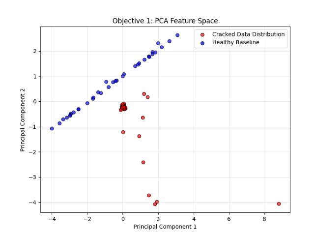
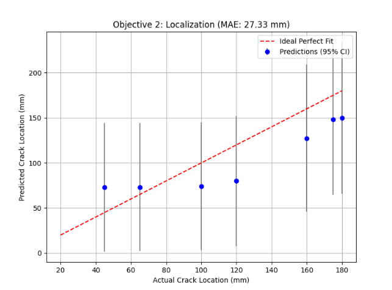
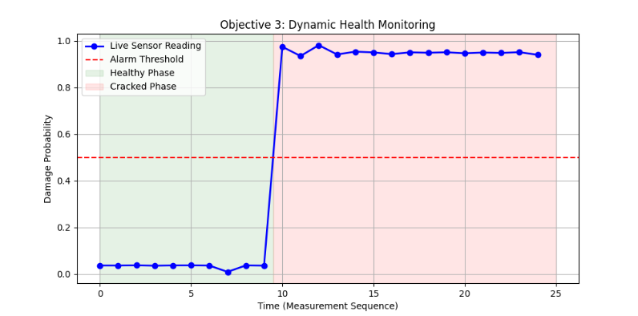

# 📡 AI-Enabled Structural Health Monitoring (SHM) using Piezoelectric Sensors

> **A Physics-Guided Probabilistic Machine Learning Framework for Automated Damage Detection and Localization in Aerospace and Civil Infrastructure.**

---

## 📖 Project Overview

Safeguarding aging civil and aerospace infrastructure requires a shift from reactive maintenance to continuous, proactive evaluation. While active sensing using ultrasonic guided Lamb waves offers immense potential for automated defect detection, the wide-scale deployment of AI in Structural Health Monitoring (SHM) is hindered by a critical bottleneck: **the severe scarcity of real-world training data.**

This project bypasses the empirical data bottleneck by developing a hybrid computational framework. We utilize **COMSOL Multiphysics** to engineer a high-fidelity "Digital Twin" of an aluminium plate equipped with surface-bonded PZT-5H piezoelectric sensors. By generating a mathematically rigorous dataset of wave scattering phenomena and coupling it with a **physics-guided Artificial Intelligence pipeline**, we achieve flawless damage detection and highly accurate probabilistic localization.

---

## 🧠 The AI Pipeline Architecture

Instead of feeding highly dimensional, noisy time-series data directly into black-box neural networks, this project utilizes **Physics-Guided Feature Extraction**. We compress complex wave mechanics into interpretable statistical descriptors:

* **Root Mean Square (RMS):** Captures forward-wave energy attenuation caused by defect scattering.
* **Kurtosis:** Detects the "tailedness" and sharp spikes caused by defect-induced echoes.
* **Time of Flight (ToF) & Peak-to-Peak:** Provides physical spatial-temporal markers of wave propagation.

These features are then fed into a two-stage probabilistic machine learning engine:
1.  **Damage Detection:** Support Vector Machine (SVM)
2.  **Damage Localization:** Gaussian Process Regression (GPR)

---

## 📊 Key Objectives & Results

### Objective 1: Damage Detection (Binary Classification)
We implemented a **Support Vector Machine (SVM)** with a linear kernel to establish a decision boundary between pristine and damaged structural states. By projecting our physics-guided features (RMS, Kurtosis) into a lower-dimensional space using Principal Component Analysis (PCA), the data exhibited profound linear separability.

* **Result:** The SVM achieved a flawless **100% Detection Accuracy** on unseen test data, with zero false positives or false negatives.

*> **Figure 1:** PCA projection demonstrating clear linear separability between the augmented healthy baseline and cracked structural states.*

### Objective 2: Probabilistic Localization (Regression)
Unlike deterministic models that output a single spatial guess, we employed **Gaussian Process Regression (GPR)** using a custom `Matern + WhiteKernel` covariance function. This Bayesian approach treats damage diagnosis as a stochastic inverse problem, outputting a probability distribution.

* **Result:** The model achieved a Mean Absolute Error (MAE) of **~27.33 mm** across a 500mm plate.
* **Innovation:** The GPR successfully outputs **95% Confidence Intervals**, providing vital Uncertainty Quantification (UQ) for engineering safety.

*> **Figure 2:** GPR predictions vs. Actual crack locations, featuring 95% Confidence Intervals for Uncertainty Quantification.*

### Objective 3: Dynamic Health Monitoring Simulation
To simulate real-world continuous monitoring, the model evaluates sequential time-series data, injecting dynamic environmental Gaussian white noise. The SVM outputs a continuous "Damage Probability" score.

*> **Figure 3:** Real-time health monitoring simulation tracking the transition from a healthy phase to a damaged phase, triggering an automated safety alarm.*

---

## 📈 Model Performance Summary

| Metric | Machine Learning Model | Score |
| :--- | :--- | :--- |
| **Detection Accuracy** | Support Vector Machine (Linear) | **100.0%** |
| **False Positive Rate** | Support Vector Machine (Linear) | **0.0%** |
| **Localization Error (MAE)** | Gaussian Process Regression (Matern) | **~27.33 mm** |
| **Noise Robustness** | Data Augmentation + Feature Extraction | Highly Stable |

---

